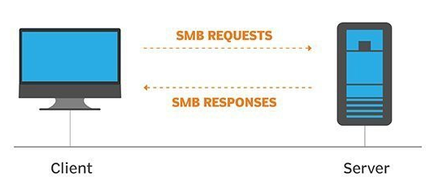
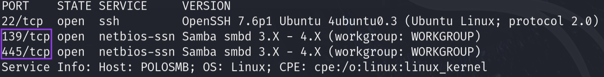
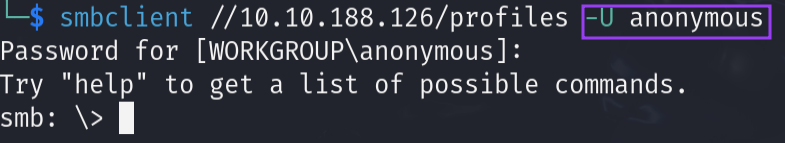
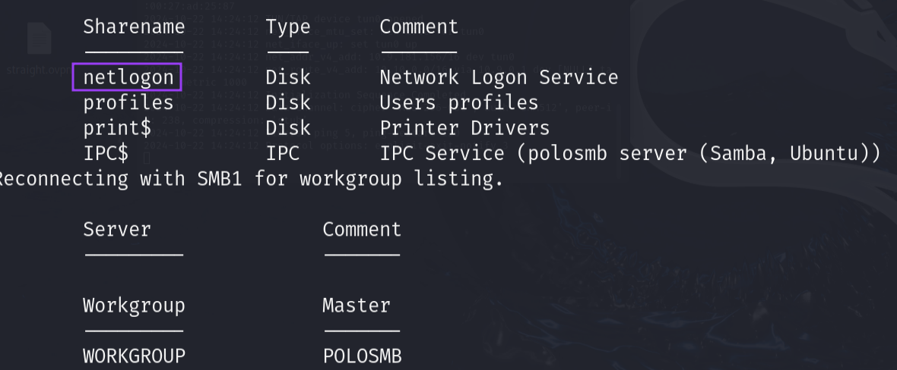
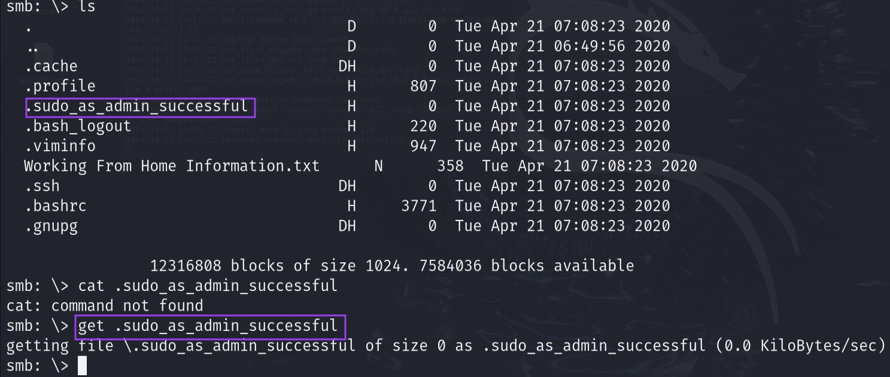
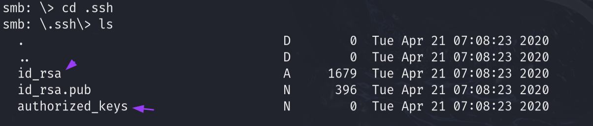
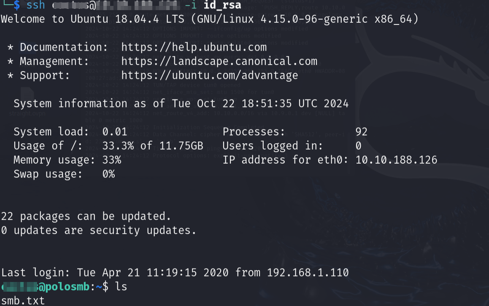

## What is** SMB** ?

**SMB **- **S**erver **M**essage **B**lock Protocol - is a client-server communication protocol used for sharing access to files, printers, serial ports and other resources on a network

The **SMB** protocol is known as a response-request protocol, meaning that it transmits multiple messages between the client and server to establish a connection. Clients connect to servers using **TCP**/**IP** (actually NetBIOS over TCP/IP as specified in RFC1001 and RFC1002), NetBEUI or IPX/SPX.

## How does **SMB** works ?

## Enumerating **SMB :**

**Tools Used :**

1. SMBclient
2. Nmap

First we start with enumerating open ports :

Then We use smbclient to try to connect an anon user which is the most common misconfuguration :

we find interesting stuff :

**joke def not netlogon :D**

we connect to profiles wich seels unusual and we have permission to do so:

Find multiple files, we got the juicy `.ssh` ready to be explored

we can get `id_rsa` but not `authorized_keys`

using `id_rsa` with the right premissions we got access to the machine :

And simply this is **SMB** in a *cybersecurity* perspective :)
